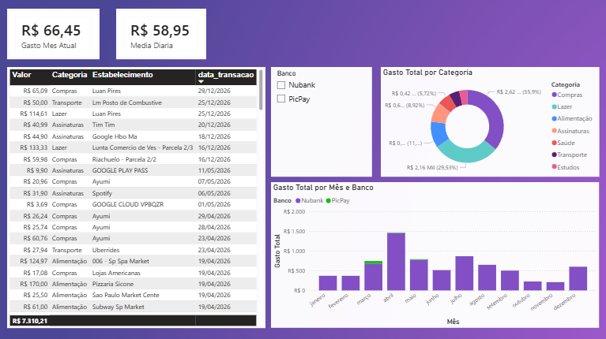

# 📊 Automated Financial ETL Pipeline & BI Dashboard

Um pipeline automatizado de ponta a ponta para extração, higienização, categorização inteligente (utilizando IA local) e visualização de faturas de cartão de crédito (Nubank e PicPay). 

O objetivo deste projeto é eliminar o trabalho manual de preenchimento de planilhas financeiras, consolidando os dados em um banco relacional seguro e gerando insights acionáveis por meio de um painel de Business Intelligence.

---

## 🏗️ Arquitetura do Projeto

O fluxo de dados segue a arquitetura clássica de um pipeline de ETL (Extract, Transform, Load):

```text
[ Gmail (PDFs) ] ➡️ [ n8n Orquestrador ] ➡️ [ JavaScript (Limpeza) ]
                                                    ⬇️
[ Power BI ] ⬅️ [ PostgreSQL ] ⬅️ [ Upsert ] ⬅️ [ Ollama (Llama 3.2 Local) ]
```

1. **Extract (Extração)**: Um gatilho agendado (ou por webhook) monitora o Gmail em busca de novas faturas em formato PDF enviadas pelas instituições financeiras.
 
2. **Transform (Transformação)**: Um script em JavaScript extrai o texto bruto do PDF e normaliza os dados (conversão de strings de data para o padrão ISO, formatação de valores para decimal puro).
   - O texto do estabelecimento passa por uma higienização regex para remover ruídos comuns de adquirentes (ex: PAG*, EBN*, DI*).

3. **IA Local (Categorização)**: O nome limpo do estabelecimento é enviado para um modelo Llama 3.2 rodando de forma 100% local via Ollama. A IA atua como um classificador categórico rígido, rotulando a transação em categorias pré-definidas (Alimentação, Assinaturas, Estudos, Transporte, Lazer, Compras, Saúde).

4. **Load (Carga)**: Os dados passam por um nó de filtragem que compara as transações com o histórico existente para evitar redundâncias. Em seguida, os dados inéditos são persistidos em um banco PostgreSQL utilizando uma operação de Upsert baseada em uma chave de unicidade composta.

5. **Notificação**: Ao final do loop de processamento, o fluxo agrupa os gastos da fatura e envia um relatório formatado em HTML diretamente para o Telegram.

## 🛠️ Tecnologias e Infraestrutura Utilizadas

-  **Orquestração**: n8n
-  **Linguagem de Script**: JavaScript (Node.js no ambiente n8n)
-  **Inteligência Artificial**: Ollama (Modelo Llama 3.2:3b executado localmente)
-  **Banco de Dados**: PostgreSQL
-  **Visualização de Dados**: Power BI
-  **Infraestrutura**: Servidor doméstico dedicado para self-hosting e containerização

## 📂 Estrutura do Repositório

- `workflow.json`: Arquivo contendo a exportação completa do fluxo estruturado no n8n.
- `init.sql`: Script de criação da tabela transacoes_cartao, incluindo definições de tipos, constraints de unicidade (UNIQUE) e índices de performance.

## 🚀 Como Replicar este Projeto

1. Banco de Dados
Execute o script contido em init.sql no seu servidor PostgreSQL para instanciar a tabela com a estrutura correta e o índice otimizado para consultas cronológicas.

2. Pipeline no n8n<br>
1 Crie um novo workflow no seu n8n.<br>
2 Importe o arquivo workflow.json.<br>
3 Configure as suas credenciais para os nós de:
    - Gmail (OAuth2 ou App Password)
    - Ollama (Apontando para a URL do seu servidor local)
    - PostgreSQL (Credenciais de acesso ao banco)
    - Telegram (Token do Bot e Chat ID)
3. Modelo de IA
   ```bash
     ollama run llama3.2:3b
   ```
   > (Nota: Para ambientes com restrição estrita de hardware, o prompt do sistema foi otimizado para manter alta aderência a regras de formatação estruturada).

4. Power BI
  - Abra o Power BI Desktop e selecione Obter Dados > Banco de Dados PostgreSQL.
  - Insira o IP do seu servidor e o nome do banco de dados no modo Importar.
  - Utilize as medidas DAX recomendadas para calcular métricas como Gasto Total, Gasto no Mês Atual e Média de Gasto Diário.

## 📊 Dashboard Finalizado

Abaixo está a interface do painel gerado no Power BI a partir do banco de dados populado pelo pipeline:
> O dashboard inclui distribuição percentual por categorias mapeadas pela IA, histórico comparativo de despesas por instituição financeira (Nubank vs. PicPay) e detalhamento granular de transações ordenadas cronologicamente.

<div align="center">
  
</div>


